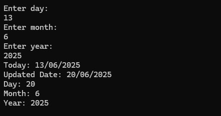

# 📦 Loyiha to‘plami — C# asosidagi mini loyihalar

Ushbu to‘plamda C# tilida yaratilgan 4 ta kichik dastur mavjud. Har biri ma’lum bir mavzuni o‘rganish va amaliyotga tatbiq etish uchun mo‘ljallangan.

---

## 📘 1. Book — Kitob Tizimi

### 📌 Tavsif:
Kitob ma’lumotlarini saqlash va ularni ko‘rsatish uchun yaratilgan oddiy dastur. Har bir kitob uchun sarlavha, muallif va chop etilgan yili saqlanadi.

### ⚙️ Texnologiyalar:
- C#
- .NET Console Application

### 🔑 Funksiyalar:
- Kitob yaratish
- Kitob haqida ma’lumot chiqarish
- Kitob yangi chop etilganmi (2010 yildan keyinmi) tekshirish

### 🖼️ Skrinshot:

---

## ⚪ 2. Circle — Aylana Hisoblash Tizimi

### 📌 Tavsif:
Foydalanuvchidan aylana radiusini qabul qilib, uning yuzasi, diametri va uzunligini hisoblaydigan dastur.

### ⚙️ Texnologiyalar:
- C#
- .NET Console Application

### 🔑 Funksiyalar:
- Radiusni o‘rnatish va olish
- Yuza hisoblash (`GetArea`)
- Diametr hisoblash (`GetDiameter`)
- Uzunlik hisoblash (`GetCircumference`)

### 🖼️ Skrinshot:

---

## 📅 3. Date — Sana Bilan Ishlash Tizimi

### 📌 Tavsif:
Kun, oy va yil ma’lumotlarini saqlaydi va sanani `DD/MM/YYYY` formatida chiqaradi.

### ⚙️ Texnologiyalar:
- C#
- .NET Console Application

### 🔑 Funksiyalar:
- Sana o‘rnatish (`SetDate`)
- Kun, oy, yilni alohida olish
- Formatlangan sanani chiqarish (`ToString()`)

### 🖼️ Skrinshot:

---

## 🏦 4. BankAccount — Bank Hisobini Boshqarish

### 📌 Tavsif:
Foydalanuvchining bank hisobini boshqarish uchun yaratilgan tizim. Hisobga pul qo‘yish, yechish, muzlatish yoki ochish imkonini beradi.

### ⚙️ Texnologiyalar:
- C#
- .NET Console Application

### 🔑 Funksiyalar:
- Hisob yaratish (noyob ID bilan)
- Pul qo‘yish (`Deposit`)
- Pul yechish (`Withdraw`)
- Hisobni muzlatish (`FreezeAccount`)
- Hisobni faollashtirish (`UnfreezeAccount`)
- Xatoliklarni ko‘rsatish: manfiy miqdor, yetarli mablag‘ yo‘qligi, hisob muzlatilganligi

### 🖼️ Skrinshot:

